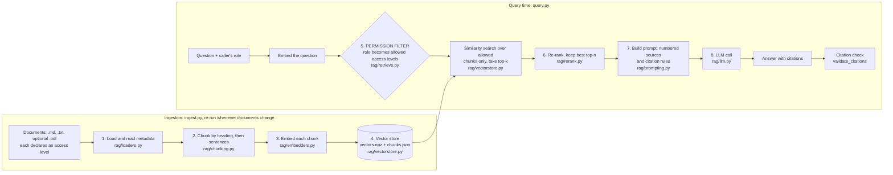
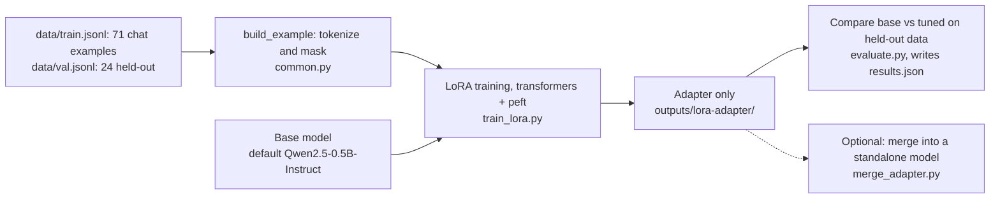
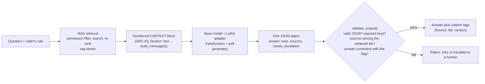

# Architecture

This page explains how the code in this repository fits together. It follows the pipeline from the video
*RAG vs Fine-Tuning for Enterprise LLMs* and names the real modules and functions, so you can open the file
next to the explanation.

Three pipelines are described:

1. [The RAG pipeline](#1-the-rag-pipeline-rag-starter) (`rag-starter/`): facts, citations, permissions.
2. [The fine-tuning pipeline](#2-the-fine-tuning-pipeline-finetune-starter) (`finetune-starter/`): behavior, not facts.
3. [The hybrid pipeline](#3-the-hybrid-pipeline-hybrid) (`hybrid/`): both together, the pattern the video calls the mature enterprise default.

The scenario throughout is the one from the video: a fictional company, **Acme Corp**, has an internal assistant that
answers *"What's our parental leave policy?"* with a citation, and the question of an ordinary employee (for example an
intern) must never retrieve executive-compensation text. All companies, people, policies and figures are fictional. Any
number in this repository that looks like a benchmark is illustrative only: measure on your own stack.

## Glossary (ten terms, in plain language)

- **Chunk**: a passage cut out of a document (up to about 220 words here). It is the unit that is stored, searched and cited.
- **Embedding**: a list of numbers that stands for a piece of text, so that texts can be compared by arithmetic. The default embedder here only matches shared words; a real embedding model also captures meaning.
- **Cosine similarity**: a score for how closely two embeddings point the same way. Near 1 means very similar, near 0 means unrelated.
- **Top-k**: keep only the k best-scoring chunks (`TOP_K`, 20 here) and throw the rest away.
- **Re-ranking**: a second, more careful scoring pass over those k candidates; the best few (`RERANK_TOP_N`, 5 here) go into the prompt.
- **hit@k**: in an evaluation, the share of test questions for which a chunk that holds the answer appears among the top k results.
- **LoRA**: a fine-tuning method that leaves the original model weights alone and trains a small set of extra weights instead. (QLoRA is the same idea on a 4-bit-quantized base model to save memory; this repository implements plain LoRA only.)
- **Adapter**: the small file that holds those extra LoRA weights. It only works together with the base model it was trained on.
- **`MIN_SCORE`**: the lowest similarity a chunk needs to count as a candidate at all (default 0.05). The right value depends on the embedder, so re-tune it whenever you change the embedder.
- **Permission filter**: the step that turns the caller's role into the list of access levels the caller may read and removes every other chunk *before* any searching happens.

---

## 1. The RAG pipeline (`rag-starter/`)

`rag/pipeline.py` wires the steps together: `build_index()` is the ingestion half; `RagPipeline.prepare()` runs everything
up to (not including) the LLM call, and `RagPipeline.answer()` makes the call and checks the citations. Splitting
`prepare()` from `answer()` is what makes `query.py --dry-run` possible: you can read the exact prompt without sending anything.

### One question, traced end to end

The numbers below come from a real `--dry-run` of the demo corpus (34 chunks, default settings). The last step is
described, not measured, because it needs a live model and there was no API key while this repository was built.

1. **Question:** `What's our parental leave policy?`
2. **Role:** `employee`. The role table in `rag/config.py` allows the access level `all` only.
3. **Allowed chunks:** 25 of the 34 chunks. The 9 chunks of `exec-compensation-2026.md` (access `executive`) are removed before any scoring.
4. **Search:** 7 of the allowed chunks score at or above `MIN_SCORE` (0.05); the search would return at most `TOP_K` = 20.
5. **Top 5 after re-ranking:**
   - `Parental leave` in `hr-policy-2026.md` (score 0.490), the right answer.
   - `Acme Corp HR Policy 2026` (0.421), `Sick leave` (0.275), `Acme Corp IT Security Policy` (0.272) and `Acme Corp Expense Policy` (0.263).
   - These four are weak: the default embedder matches words, not meaning, and the word "policy" appears in every document's introduction. The prompt tells the model to ignore irrelevant sources.
6. **Prompt:** the system rules, then five numbered `<source id="1" cite="[Source: hr-policy-2026.md, Parental leave]">` blocks, then the question.
7. **Answer (not run here):** a live model is expected to state the 12-week entitlement and end the sentence with the tag `[Source: hr-policy-2026.md, Parental leave]`. `validate_citations()` then checks that this tag belongs to a chunk that was retrieved.

Run it yourself: `python query.py "What's our parental leave policy?" --role employee --dry-run` inside `rag-starter`.

### Stage by stage

| # | Stage | Module and function | In one line |
|---|---|---|---|
| 1 | Load | `rag/loaders.py`, `load_documents()` | Read documents and their metadata; reject any without a valid access level. |
| 2 | Chunk | `rag/chunking.py`, `chunk_documents()` | Split by heading, then pack whole sentences into chunks. |
| 3 | Embed | `rag/embedders.py`, `get_embedder()` | Turn each chunk into a vector. |
| 4 | Store | `rag/vectorstore.py`, `VectorStore` | Save vectors and metadata; refuse a mismatched embedder. |
| 5 | Permission filter | `rag/retrieve.py`, `permission_filter()` and `retrieve()`; `VectorStore.search()` | Keep only chunks the caller's role may read, before any scoring. |
| 6 | Re-rank | `rag/rerank.py`, `LexicalReranker` (default) | Re-score the candidates and keep the best few. |
| 7 | Prompt | `rag/prompting.py`, `build_prompt()` | Numbered sources plus citation rules. |
| 8 | Generate and check | `rag/llm.py`, `generate_answer()`; `rag/prompting.py`, `validate_citations()` | Call the model, then check that every cited tag was retrieved. |

**1. Load** (`load_documents()`)

- Reads `.md` and `.txt` files that start with a small front-matter block (`title`, `access`, `department`, `updated`).
- PDFs work with the optional `pypdf` package and a sidecar `.meta` file, and keep page numbers.
- Every document must declare a valid `access` level or it is rejected. The loader fails closed instead of guessing a default.

**2. Chunk** (`chunk_documents()`)

- Splits at Markdown headings first, so a chunk never mixes two topics, then packs whole sentences up to `CHUNK_WORDS` and repeats `CHUNK_OVERLAP` words between neighbors.
- Each `Chunk` carries `source`, `section`, `page`, `access`, `department` and `updated` next to its text. That metadata is what later makes filtering and citations possible.
- Sizes are counted in words. 220 words is roughly 300 tokens if you assume about 0.75 words per token, so the default sits at the low end of the video's 300-800 token guideline because the demo sections are short.

**3. Embed** (`get_embedder()`)

- Turns text into unit-length vectors. The default `HashingEmbedder` is offline and lexical: it matches shared words, not meaning.
- `SentenceTransformerEmbedder` is an optional real semantic model.
- The text that gets embedded is the section heading plus the body (`Chunk.embed_text`), because a chunk cut out of its section loses the heading that told the reader what it is about.

**4. Store** (`VectorStore`)

- A brute-force numpy store saved as two files.
- It records which embedder built it and refuses to be searched by a different one (`check_embedder()`), because vectors from different models are not comparable.

**5. Permission filter** (`permission_filter()`, `retrieve()`, `VectorStore.search()`)

- The caller's role is translated into a metadata filter (`{"access": {...}}`) using the table in `rag/config.py`.
- The store builds a mask from that filter **before** it computes any similarity, so restricted chunks are never scored, cannot use up a top-k slot and never reach the prompt.
- An unknown role or unknown filter field raises an error rather than being ignored.

**6. Re-rank** (`LexicalReranker`)

- The vector search is fast but coarse; a re-ranker looks at the question and each candidate together. The video's recipe is "retrieve the top 50, re-score, keep the best 5". The demo corpus has only 34 chunks, so the defaults are `TOP_K=20` and `RERANK_TOP_N=5`.
- The default re-ranker is a simple lexical blend (weights are illustrative, not tuned). `PassthroughReranker` disables re-ranking, and `CrossEncoderReranker` is an optional hook for a cross-encoder model.
- Measure a re-ranker with `evals/eval_retrieval.py` before trusting it. On the demo data the lexical one gave a one-question gain at hit@3 with the default embedder, but lowered hit@1 by two questions with a semantic embedder (18 questions, one run each, so not evidence of a real difference).

**7. Prompt** (`build_prompt()`)

- Puts the kept chunks into numbered `<source id=... cite=...>` blocks.
- Tells the model to use only those sources, to cite with the exact tag (for example `[Source: hr-policy-2026.md, Parental leave]`, or `[Source: HR-Policy-2026.pdf, p.12]` for a PDF page), and to say it does not know when the sources are not enough.
- A basic prompt-injection mitigation: text in a chunk that looks like a `<source` or `</source` tag is neutralized, and attribute values are HTML-escaped. This reduces risk; it is not a security boundary.

**8. Generate and check** (`generate_answer()`, `validate_citations()`)

- `rag/llm.py` is the only module that needs an API key (Anthropic SDK). It handles refusals, truncation and API errors.
- Afterwards `validate_citations()` checks that every cited tag matches a chunk that was actually retrieved. That proves a cited source was retrieved; it does **not** prove the source supports the claim.
- If retrieval finds nothing allowed and relevant, the pipeline answers "I do not know" **without calling the model at all**.

### Why the permission filter sits where it does

Access control belongs in retrieval, before the model sees any text. A prompt that says "do not reveal executive pay"
is not a control: a model cannot un-see text it was given, and prompts can be bypassed. If a restricted chunk never
enters the prompt, it cannot leak, whatever the user types. The demo documents show it: `exec-compensation-2026.md` is
marked `access: executive`; ask *"What is the CEO's base salary?"* as `--role employee` and none of its text is retrieved.

The same idea is why "search first, filter afterwards" is a trap: you can end up with fewer than k results (or none)
even though allowed chunks exist, and restricted text has already been touched by the search. When you replace the
numpy store with a real vector database, check in its documentation and by testing that the filter is applied before or
during the search, and that restricted chunks can never be returned. `rag-starter/tests/test_access_control.py` is a starting point.

### Configuration and evaluation

Settings come from environment variables or a `.env` file (`rag/config.py`, template in `rag-starter/.env.example`).
`rag-starter/evals/eval_retrieval.py` measures hit@k on 18 labeled questions plus two access-control probes, and has a
`--sweep` switch to show how chunk size changes retrieval on this tiny corpus. It is a demonstration of *how to measure*,
not a benchmark: build a question set from your own documents before you tune anything.

---

## 2. The fine-tuning pipeline (`finetune-starter/`)

Fine-tuning here changes **behavior** (formal tone, one strict JSON object, and, as a goal, saying so instead of guessing;
how well that last part is learned is measured below), not facts. The training data therefore carries its own `CONTEXT` in
every prompt, and the model is taught to answer from that context only.
The training passages describe a different fictional company (Globex Corp) than the RAG documents (Acme Corp), on
purpose: nothing the adapter could memorize can then conflict with a fact that retrieval supplies.

**Data** (`data/train.jsonl`, `data/val.jsonl`, `data/general_probe.jsonl`)

- Chat-format examples. About 28 percent of the training set (20 of 71) is unanswerable: the context lacks the answer, and the target reply says so and sets `needs_escalation` to `true`.
- The intent is to teach escalating instead of guessing. Whether a model actually learned it is what `evaluate.py` measures. In the recorded runs the default 0.5B model escalated all 7 unanswerable validation questions but also escalated 3 of 17 answerable ones, and the 135M model mostly did not learn it (2 of 7). One seed and a tiny validation set: see `finetune-starter/README.md`.
- The validation examples use different passages from training. The probe file holds ten generic prompts for a crude forgetting check.

**Masking** (`common.py`, `build_example()`)

- The loss is computed on the assistant reply only (prompt tokens get label `-100`), so the model learns *how to answer*, not to reproduce the prompt.
- Examples longer than `--max-len` are dropped, never truncated, because a cut-off JSON target would teach broken JSON.

**Training** (`train_lora.py`)

- LoRA through `peft` (defaults: rank 16, alpha 32, dropout 0.05, all linear layers) and the Hugging Face `Trainer`, with validation loss every epoch.
- Prints the loss per epoch and an overfitting hint (not for a `--smoke` run). Only the small adapter is saved.

**Evaluation** (`evaluate.py`)

- Base and tuned outputs side by side: strict JSON validity, schema compliance, escalation behavior, and the general probe.
- `--prompt-baseline` adds the base model with the format spelled out in the prompt. Try that before deciding you need fine-tuning at all: in the recorded run with the default model, prompting alone also produced valid JSON.

**Merge** (`merge_adapter.py`, optional)

- `merge_and_unload` into a standalone model folder.

The trade-off, as the video states it: LoRA trains a small set of extra weights, so it is typically far cheaper than
full fine-tuning (the video's illustrative ranges are roughly $500-$5K for LoRA versus $40K-$100K+ per full run; these are
not measurements of this repository). Its risks are overfitting a narrow dataset, catastrophic forgetting, no citations,
and sensitive training data diffused into the weights, where it is hard to remove. So: never train on secrets or personal data.

---

## 3. The hybrid pipeline (`hybrid/`)

RAG supplies the facts, with citations and with permissions enforced at retrieval. A light LoRA fine-tune makes the model
answer in the format and tone your application needs. `hybrid/hybrid_example.py` is a short, commented example of the
hand-off between the two.

**Retrieve** (`RagPipeline.prepare()` from `rag-starter`)

- Exactly the pipeline in section 1, including the permission filter.
- By default only the best 3 chunks are used (`--top-n`), because the adapter was trained on short contexts.

**Prompt** (`build_messages()`)

- Each chunk becomes one line `[SRC-01] Section: text`, and the user message is `CONTEXT:` followed by those lines, a blank line and `QUESTION: ...`. This is the same shape as `finetune-starter/data/train.jsonl`.
- `SRC-01`, `SRC-02`, ... play the role of the ids in the training data (`TRV-08`, `HR-17`), and a dictionary maps each id back to the human-readable `[Source: file, section]` tag.
- The system message is the exact string used in the training data, so it names Globex Corp even though the retrieved text is about Acme Corp. That is a demo shortcut; in your own project, train and run with your own system message.

**Generate** (`generate()`)

- Loads the base model, attaches the adapter with `PeftModel.from_pretrained`, and decodes greedily.
- Renders the prompt with `common.encode_prompt()`, the function training and `evaluate.py` use, so the model sees the same rendering it was trained on.
- Heavy libraries are imported inside this function only, so `--dry-run` needs no torch.

**Validate** (`validate_output()`)

- The whole output must be one JSON object with exact keys and types (`common.check_schema()`).
- Every id in `sources` must be one that was retrieved, and a non-escalation answer must cite at least one source.
- A non-escalation answer must not say that the information is unavailable (a keyword screen; it catches a self-contradicting answer, not every paraphrase).
- This proves the output is well formed, refers to retrieved ids and does not contradict its own flag in the obvious ways. It does not prove the answer is true.

Two properties are worth naming. First, **the fine-tuned model never sees a chunk the caller may not read**, because
filtering happens before the prompt exists. Second, **the adapter contains no facts the pipeline relies on**: change a
policy document, re-ingest, and the answers change without retraining. You retrain only when the behavior you want changes.

Honest gaps: the adapter in `finetune-starter` was trained on short, clean passages, and retrieved chunks are longer and
messier. A real deployment should add training examples that look like real retrieved context (including irrelevant
chunks and unanswerable questions) and measure the whole pipeline, not just each half. The recorded hybrid runs (two small
models, three questions each, see `hybrid/README.md`) show that the code path works and that answers range from good to poor;
they are not a measurement of answer quality.

---

## Swapping in production components

| Demo component | Replace it with | Keep this contract |
|---|---|---|
| `HashingEmbedder` | A learned embedding model or a hosted embedding API | Subclass `Embedder`: set `name` and `dimension`, implement `embed_documents()`. Re-ingest after any change, and re-tune `MIN_SCORE`. |
| `VectorStore` (numpy, brute force) | A vector database with native metadata filtering | `search(query_vector, top_k, filters, min_score)`, with the filter applied before or during the search. Store `source`, `section`, `page` and `access` next to each vector. |
| `LexicalReranker` | A cross-encoder re-ranker, or none | Subclass `Reranker`: `rerank(query, hits)` returns all hits, best first. Compare with `PassthroughReranker` on your own eval set. |
| Role table in `rag/config.py` | Groups or claims from your identity provider | Turn the caller's identity into an allow-list of access levels **before** retrieval. Never let the model decide who may see what. |
| `rag/llm.py` (Anthropic SDK) | Any chat model | The prompt builder and the citation validator are independent of the provider. |
| `evals/eval_retrieval.py` question set | 20-50 real questions from your own documents, each with its expected source | Measure retrieval hit rate before touching the model, and re-run after every change. |

## Data handling

- **The live path sends text to your LLM provider.** In `rag/llm.py` the question and the chunks kept for the prompt (five by default) are sent to the Anthropic API, so text from your documents leaves your machine. Check where your model runs and what its provider's terms say about retention. `--dry-run` sends nothing.
- **Deleting a document takes more than deleting the file.** Remove the source, re-ingest so its chunks leave the index, and then purge the other places that may still hold a copy: logs, caches, backups and saved evaluation sets. Text that was trained into adapter weights cannot be removed this way at all, which is why sensitive facts belong in retrieval, not in training data.
- **Keep secrets and personal data out of training files.** Fine-tuning diffuses them into the weights.

## What this architecture does not cover

- It is a teaching template, not a production system: no authentication, no logging or audit trail, no rate limiting,
  no multi-tenant isolation, no document deletion workflow, no monitoring.
- The role table is a stand-in for a real identity provider, and the permission filter demonstrates a mechanism; it is not a security audit.
- Prompt-injection defenses are basic: sources are wrapped in tags, the model is told to treat them as data, tag-like text inside a chunk is neutralized, and attribute values are escaped. These reduce risk; they do not remove it.
- The model-output validators check form and provenance, not truth. Keep human review and escalation paths in the loop.
- See the status notes in the top-level `README.md` for exactly what was and was not tested.
